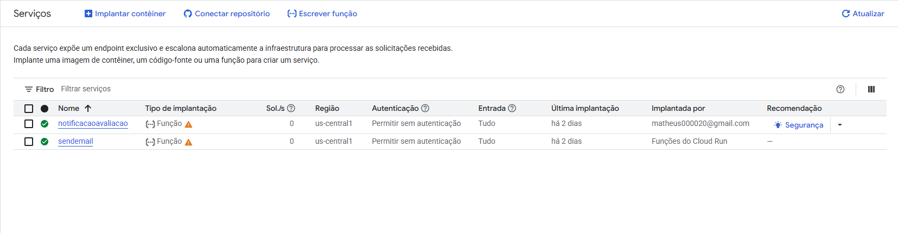

# Continuous Entregation

Sistema completo para pedidos de transporte de mercadorias, integrando **aplicativo móvel**, **backend em microserviços** e **camada serverless** para notificações e comunicações automáticas.

---

## 📱 Etapa 1: Aplicação Móvel

- Aplicativo Flutter para clientes e motoristas
- Funcionalidades:
  - Solicitação de transporte
  - Acompanhamento em tempo real
  - Avaliação de entregas
- Integração com notificações push (OneSignal)

---

## 🖥️ Etapa 2: Backend em Microserviços

- Microserviços Node.js:
  - **pedido-service**: Gerenciamento de pedidos
  - **rastreamento-service**: Rastreamento de entregas
  - **auth-service**: Autenticação e autorização (JWT)
- **Gateway API**: Orquestração e integração entre app e microserviços
- Banco de dados PostgreSQL compartilhado

---

## ☁️ Etapa 3: Funcionalidades Serverless

- **Arquitetura Event-Driven**: Microserviços publicam eventos em filas RabbitMQ
- **Consumidor Serverless**:
  - Processa eventos de finalização de pedido
  - Envia notificações push (OneSignal) e e-mails automáticos (via Cloud Functions)
- **Campanhas Promocionais**: Possibilidade de envio segmentado em massa via pub/sub
- **Escalabilidade**: Processamento assíncrono e desacoplado

### Cloud Functions

- As funções serverless estão em `/CloudFunctions/functions`
- Deploy realizado na plataforma Google Cloud Run



### API

- O deploy da API foi feito na AWS EC2


---

## 🔗 Fluxo Integrado

1. **Cliente faz pedido** pelo app → Gateway → Microserviço de pedidos
2. **Motorista aceita/finaliza** pedido → Evento publicado na fila RabbitMQ
3. **Consumidor serverless**:
   - Envia notificação push ao cliente (OneSignal)
   - Envia e-mail de resumo para cliente e motorista
4. **App exibe notificações** e atualizações em tempo real

---

## 🚀 Como Executar (Teste local)

### Pré-requisitos

- Docker e Docker Compose
- Node.js (para desenvolvimento local)
- Flutter (para rodar o app mobile)

### Subindo toda a stack

```sh
cd api
docker-compose up --build
```

- O consumidor será iniciado automaticamente como um serviço Docker.
- O gateway estará disponível em [http://localhost:50092](http://localhost:50092).
- O gateway produção estará disponível em [http://52.91.225.62:50092](http://52.91.225.62:50092).

### Acessando o Swagger

- Documentação interativa disponível em:
  - [http://localhost:50092/api-docs](http://localhost:50092/api-docs) (desenvolvimento)
  - [http://52.91.225.62:50092/api-docs](http://52.91.225.62:50092/api-docs) (produção)

### Rodando o app Flutter

```sh
cd continuous_entregation
flutter pub get
flutter run
```

---

## 📦 Estrutura dos Diretórios

```
api/
  pedido-service/
  rastreamento-service/
  auth-service/
  gateway/
  consumidor.js
  publisher.js
  docker-compose.yml
assets/
  images/
    cloudfunctions.png
    apiNode.png
  videos/
    TelaAppCliente.mp4
    TelaEmail.mp4
continuous_entregation/
  lib/
  android/
  ios/
```

---

## 📨 Funcionalidades Serverless

- **Notificação de Avaliação**: Cliente recebe push ao finalizar entrega
- **E-mail de Resumo**: Cliente e motorista recebem e-mail automático
- **Campanhas Promocionais**: (Opcional) Envio segmentado via fila/tópico

---

## 🛡️ Autenticação

- JWT entre app, gateway e microserviços
- Consistência de autenticação em todas as camadas

---

## 📑 Observações

- Todos os eventos são processados de forma assíncrona e confiável via RabbitMQ
- O sistema é facilmente escalável e desacoplado
- O app e backend compartilham identidade visual e dados

---

## 🎥 Demonstração

- 

- **Clientes**: [Assista ao vídeo de demonstração](assets/videos/TelaAppClientes.mp4)

- **Confirmação de e-mail**: [Envio de e-mails](assets/videos/TelaEmail.mp4)

- **Motorista**: [Assiste ao vídeo de demonstração](assets/videos/TelaMotorista.mp4)

---

## 👨‍💻 Equipe

Gabrielle Lira

> Projeto desenvolvido para a disciplina de Laboratório de Desenvolvimento de Aplicações Móveis e Distribuídas – PUC.
